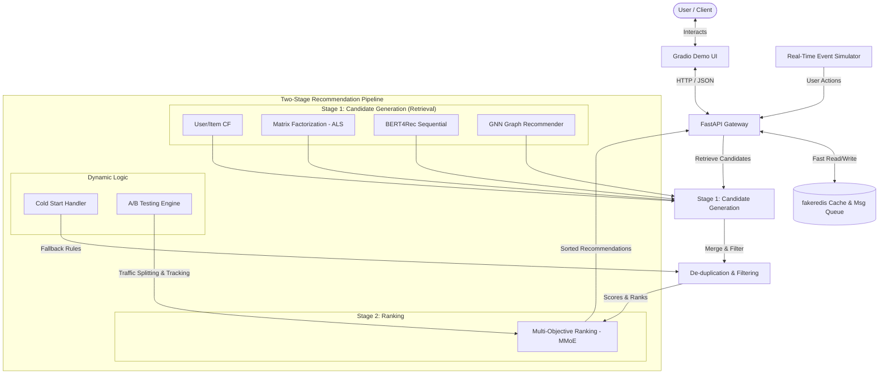

# RecoStream: YouTube-Scale Real-Time Recommendation System
[](https://www.python.org/)
[](https://pytorch.org/)
[](https://fastapi.tiangolo.com/)
[](https://gradio.app/)
[](https://redis.io/)
[](LICENSE)

An end-to-end, production-grade recommendation engine demonstrating state-of-the-art **Machine Learning models** coupled with robust **System Design** principles. Inspired by YouTube's classic two-stage recommendation framework (Candidate Generation & Ranking), this project is built entirely for local execution and showcase purposes.

> [!NOTE]
> ### By the end of this guide you will have:
> * **✅ A working recommendation system** (like YouTube)
> * **✅ 5 different AI models trained**
> * **✅ A live demo website** (free!)
> * **✅ Tests that prove it works**
> * **✅ A GitHub portfolio project**
> * **✅ Resume bullet points ready to copy**
> 
> * **Time needed**: 4-6 hours total
> * **Cost**: $0.00 absolutely free

---

## 🏗️ System Architecture



---

## 🚀 Implemented Features

1. **Collaborative Filtering**: Memory-based User-User and Item-Item algorithms to find classic similarities.
2. **Matrix Factorization (ALS)**: Alternating Least Squares (ALS) latent factor modeling for scalable collaborative retrieval.
3. **BERT4Rec**: A Transformer-based sequential model that models users' history as sequences and predicts next-item interactions (bidirectional representation learning).
4. **Graph Neural Network (GNN)**: A custom PyTorch message-passing network leveraging social and co-occurrence graphs for high-order relational retrieval.
5. **Multi-Objective Ranking (MMoE)**: Multi-gate Mixture-of-Experts neural network optimizing simultaneously for multiple targets (e.g., Click-Through Rate & Watch Time).
6. **Real-time Streaming Simulation**: Simulates high-velocity user activity streams (clicks, views, shares) queued into `fakeredis`.
7. **A/B Testing Framework**: Evaluates model performance via automated online metric updates (CTR, retention, NDCG) and user bucket allocation.
8. **Cold Start Handling**: Smart heuristic fallback models using demographics, trending statistics, and metadata similarity for new users and items.
9. **FastAPI Backend**: A production-ready API with schema validations, structured responses, and async routers.
10. **Gradio Demo UI**: A modern interactive front-end web dashboard to browse recommendations, view model profiles, and trigger streaming events in real-time.

---

## 📂 Project Directory Structure

```text
recommantation-systeam/
├── data/
│   ├── raw/                  # Raw simulated event datasets
│   └── processed/            # Cleaned and engineered features for training
├── models/
│   └── checkpoints/          # Saved model weights (.pth, .pkl)
├── notebooks/                # Exploratory Data Analysis & training experiments
├── src/
│   ├── __init__.py           # Package entry
│   ├── config.py             # Global configurations & hyper-parameters
│   ├── data_pipeline/        # Data pipelines & loading systems
│   │   ├── __init__.py
│   │   ├── data_loader.py
│   │   └── preprocessors.py
│   ├── models/               # Core ML Models
│   │   ├── __init__.py
│   │   ├── collaborative_filtering.py
│   │   ├── matrix_factorization_als.py
│   │   ├── bert4rec.py
│   │   ├── gnn_recommender.py
│   │   └── mmoe_ranking.py
│   ├── streaming/            # Event simulation & queueing
│   │   ├── __init__.py
│   │   ├── simulator.py
│   │   └── redis_client.py
│   ├── ab_testing/           # Traffic routing & online metric evaluators
│   │   ├── __init__.py
│   │   ├── experiment_engine.py
│   │   └── metrics.py
│   ├── cold_start/           # Handling strategies
│   │   ├── __init__.py
│   │   └── handler.py
│   ├── api/                  # FastAPI Application
│   │   ├── __init__.py
│   │   ├── main.py
│   │   ├── routes.py
│   │   └── schemas.py
│   ├── ui/                   # Gradio Web Interface
│   │   ├── __init__.py
│   │   └── app.py
│   └── utils/                # Logging and system monitoring
│       ├── __init__.py
│       ├── logger.py
│       └── metrics.py
├── tests/                    # Robust unit and integration test suites
│   ├── __init__.py
│   ├── test_models.py
│   └── test_api.py
├── .gitignore                # Standard Python Git filters
├── requirements.txt          # Python packages (100% Free & Local)
├── run.py                    # Unified master script to launch services
└── README.md                 # Project documentation
```

---

## 🛠️ Getting Started

> [!TIP]
> For a highly detailed step-by-step installation guide with tips for Windows, Mac, and Linux, check out the **[Beginner's Installation Guide](INSTALL_GUIDE.md)**!

### 1. Clone the repository & Navigate
```bash
git clone <your-repo-url>
cd "recommantation systeam"
```

### 2. Set Up Virtual Environment (Python 3.10+)
```bash
# Create virtual environment
python -m venv venv

# Activate virtual environment
# On Linux/macOS:
source venv/bin/activate
# On Windows:
# venv\Scripts\activate
```

### 3. Install Dependencies
```bash
pip install --upgrade pip
pip install -r requirements.txt
```

### 4. Run the Project
To run the entire ecosystem (FastAPI Backend + Gradio UI + Streaming Simulator):
```bash
python run.py
```
* Gradio Web UI will be active at: `http://localhost:7860`
* FastAPI Swagger Docs will be active at: `http://localhost:8000/docs`

---

## 📊 Model Profiles & Design Choices

| Model | Component | Primary Objective | Key Advantage |
| :--- | :--- | :--- | :--- |
| **Collaborative Filtering** | Retrieval (Stage 1) | Quick similarity search | Lightweight, transparent, highly interpretable baseline. |
| **Matrix Factorization (ALS)** | Retrieval (Stage 1) | Model sparse implicit feedback | Decouples user-item latent spaces with fast parallelizable solving. |
| **BERT4Rec (Transformer)** | Retrieval (Stage 1) | Dynamic sequential user history | Captures bidirectional context and shifting user tastes over time. |
| **GNN (Social Signals)** | Retrieval (Stage 1) | Graph structural relationships | Infuses transitive preferences (e.g., users who liked X also liked Y). |
| **MMoE (Ranking)** | Ranking (Stage 2) | Click-Through Rate & Watch Time | Shares expert networks across multi-tasks, mitigating trade-offs. |

---

## 📈 A/B Experimentation Design
Our A/B Testing framework routes users into buckets based on standard hashing algorithms (`SHA-256(user_id + salt)`). This ensures deterministic user allocation.
Online evaluation tracked metrics:
* **NDCG@K** (Normalized Discounted Cumulative Gain) for ranking relevance.
* **Click-Through Rate (CTR)** for user engagement.
* **Average Watch Time** to balance clickbait items.

---

## 🛡️ License
This project is licensed under the MIT License - see the LICENSE file for details.
